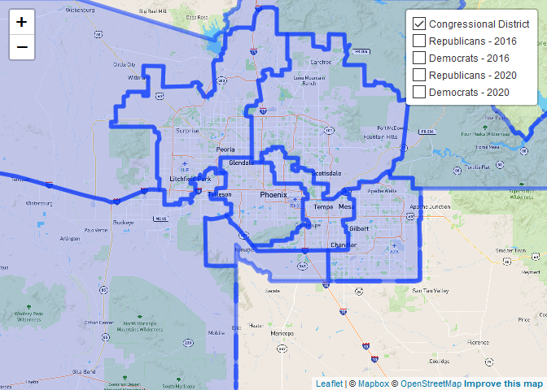

On October 6, 2020, the New York Times published an
[article](https://www.nytimes.com/2020/10/06/opinion/biden-trump-bellwether-counties-.html?searchResultPosition=1)
outlining the 10 bellwether counties for the 2020 Presidential
elections. On the list was Maricopa County, AZ, which accounts for
almost two-thirds of Arizona’s population. As it turned out, Arizona did
become a battleground state the President-Elect Biden flipped from
Republican to Democratic, and Maricopa County provided him with the
votes to do so.

Now that the dust has settled somewhat, what we want to know are:  
1. How did Maricopa Co. voted as a whole this election as compared to
2016?  
2. Did Maricopa Co.’s 8 congressional districts vote very differently
from one another?  
3. How many new voters were registered between 2016 and 2020, and in
which congressional districts can they be found?

Parts of this analysis are scaled to Maricopa County’s 8 congressional
districts to be consistent across electoral cycles, even though they are
of different sizes. This is because Maricopa County is further divided
into more than 700 electoral precincts. Ideally, we would compare
precincts over the two elections. Complicating this effort, however, is
the fact that the number of precincts have increased since 2016 and the
boundaries have changed. What has remained constant, however, are the
boundaries of congressional districts. Furthermore, the Maricopa County
Recorder’s Office and the AZ Secretary of State keep records on voter
registration by congressional districts.



Using the functions above, for example:

    ## Joining, by = c("PrecinctId", "PrecinctName")
    ## Joining, by = c("PrecinctId", "PrecinctName")
    ## Joining, by = c("PrecinctId", "PrecinctName")
    ## Joining, by = c("PrecinctId", "PrecinctName")

Congressional Districts in Maricopa County
------------------------------------------

Aggregating presidential results by congressional districts, we get the
following:

1.  Republican vote share has remained remarkably steady between 2016
    and 2020.  
2.  Both sides increased turnout.  
3.  Democrats won not by peeling off Republicans but by peeling off
    third party voters whose vote share has collapsed unlike elsewhere.

``` r
## Maricopa 2016
maricopa_2016_presidential_congress <- maricopa_2016_presidential %>%
  group_by(CD, CANDIDATE_FULL_NAME) %>%
  summarise(total_votes = sum(CONTEST_TOTAL),
            votes_candidate = sum(TOTAL)) %>%
  mutate(votes_pct = round(100*votes_candidate/total_votes),
         party = substr(CANDIDATE_FULL_NAME, 1, 3))
colnames(maricopa_2016_presidential_congress) <- c("CD", "Candidate_2016", "total_votes_2016", "votes_candidate_2016", "votes_pct_2016", "party")

maricopa_2016_3parties_congress <- maricopa_2016_3parties %>%
  group_by(CD) %>%
  summarize(total_3p_votes_2016 = sum(total_3p_votes))

## Maricopa 2020
maricopa_2020_11132020_presidential_congress <- maricopa_2020_11132020_narrow %>%
  group_by(CD, CandidateName) %>%
  summarise(total_votes = sum(Turnout),
            votes_candidate = sum(Votes)) %>%
  mutate(votes_pct = round(100*votes_candidate/total_votes),
         party = ifelse(CandidateName == "BIDEN / HARRIS", "DEM", "REP"))
colnames(maricopa_2020_11132020_presidential_congress) <- c("CD", "Candidate_2020", "total_votes_2020", "votes_candidate_2020", "votes_pct_2020", "party")

maricopa_2020_11132020_3parties_congress <- maricopa_2020_11132020_3parties %>%
  group_by(CD) %>%
  summarize(total_3p_votes_2020 = sum(total_3p_votes))


## comparing
maricopa_comparison <- inner_join(maricopa_2020_11132020_presidential_congress, maricopa_2016_presidential_congress)
```

    ## Joining, by = c("CD", "party")

``` r
maricopa_comparison <- inner_join(maricopa_comparison, maricopa_2016_3parties_congress)
```

    ## Joining, by = "CD"

``` r
maricopa_comparison <- inner_join(maricopa_comparison, maricopa_2020_11132020_3parties_congress)
```

    ## Joining, by = "CD"

``` r
maricopa_comparison <- maricopa_comparison %>%
  select(CD, party, total_votes_2016, total_votes_2020, votes_candidate_2016, votes_candidate_2020, votes_pct_2016, votes_pct_2020, total_3p_votes_2016, total_3p_votes_2020)

maricopa_comparison %>%
  kbl() %>%
  kable_minimal()
```

<table class=" lightable-minimal" style='font-family: "Trebuchet MS", verdana, sans-serif; margin-left: auto; margin-right: auto;'>
<thead>
<tr>
<th style="text-align:left;">
CD
</th>
<th style="text-align:left;">
party
</th>
<th style="text-align:right;">
total\_votes\_2016
</th>
<th style="text-align:right;">
total\_votes\_2020
</th>
<th style="text-align:right;">
votes\_candidate\_2016
</th>
<th style="text-align:right;">
votes\_candidate\_2020
</th>
<th style="text-align:right;">
votes\_pct\_2016
</th>
<th style="text-align:right;">
votes\_pct\_2020
</th>
<th style="text-align:right;">
total\_3p\_votes\_2016
</th>
<th style="text-align:right;">
total\_3p\_votes\_2020
</th>
</tr>
</thead>
<tbody>
<tr>
<td style="text-align:left;">
1
</td>
<td style="text-align:left;">
DEM
</td>
<td style="text-align:right;">
508
</td>
<td style="text-align:right;">
694
</td>
<td style="text-align:right;">
416
</td>
<td style="text-align:right;">
601
</td>
<td style="text-align:right;">
82
</td>
<td style="text-align:right;">
87
</td>
<td style="text-align:right;">
45
</td>
<td style="text-align:right;">
15
</td>
</tr>
<tr>
<td style="text-align:left;">
1
</td>
<td style="text-align:left;">
REP
</td>
<td style="text-align:right;">
508
</td>
<td style="text-align:right;">
694
</td>
<td style="text-align:right;">
47
</td>
<td style="text-align:right;">
72
</td>
<td style="text-align:right;">
9
</td>
<td style="text-align:right;">
10
</td>
<td style="text-align:right;">
45
</td>
<td style="text-align:right;">
15
</td>
</tr>
<tr>
<td style="text-align:left;">
3
</td>
<td style="text-align:left;">
DEM
</td>
<td style="text-align:right;">
70915
</td>
<td style="text-align:right;">
103324
</td>
<td style="text-align:right;">
37715
</td>
<td style="text-align:right;">
57830
</td>
<td style="text-align:right;">
53
</td>
<td style="text-align:right;">
56
</td>
<td style="text-align:right;">
4892
</td>
<td style="text-align:right;">
2328
</td>
</tr>
<tr>
<td style="text-align:left;">
3
</td>
<td style="text-align:left;">
REP
</td>
<td style="text-align:right;">
70915
</td>
<td style="text-align:right;">
103324
</td>
<td style="text-align:right;">
28308
</td>
<td style="text-align:right;">
42765
</td>
<td style="text-align:right;">
40
</td>
<td style="text-align:right;">
41
</td>
<td style="text-align:right;">
4892
</td>
<td style="text-align:right;">
2328
</td>
</tr>
<tr>
<td style="text-align:left;">
4
</td>
<td style="text-align:left;">
DEM
</td>
<td style="text-align:right;">
20787
</td>
<td style="text-align:right;">
35691
</td>
<td style="text-align:right;">
5817
</td>
<td style="text-align:right;">
11696
</td>
<td style="text-align:right;">
28
</td>
<td style="text-align:right;">
33
</td>
<td style="text-align:right;">
1249
</td>
<td style="text-align:right;">
624
</td>
</tr>
<tr>
<td style="text-align:left;">
4
</td>
<td style="text-align:left;">
REP
</td>
<td style="text-align:right;">
20790
</td>
<td style="text-align:right;">
35691
</td>
<td style="text-align:right;">
13724
</td>
<td style="text-align:right;">
23279
</td>
<td style="text-align:right;">
66
</td>
<td style="text-align:right;">
65
</td>
<td style="text-align:right;">
1249
</td>
<td style="text-align:right;">
624
</td>
</tr>
<tr>
<td style="text-align:left;">
5
</td>
<td style="text-align:left;">
DEM
</td>
<td style="text-align:right;">
341437
</td>
<td style="text-align:right;">
470040
</td>
<td style="text-align:right;">
121280
</td>
<td style="text-align:right;">
195270
</td>
<td style="text-align:right;">
36
</td>
<td style="text-align:right;">
42
</td>
<td style="text-align:right;">
28725
</td>
<td style="text-align:right;">
11060
</td>
</tr>
<tr>
<td style="text-align:left;">
5
</td>
<td style="text-align:left;">
REP
</td>
<td style="text-align:right;">
341437
</td>
<td style="text-align:right;">
470040
</td>
<td style="text-align:right;">
191432
</td>
<td style="text-align:right;">
262810
</td>
<td style="text-align:right;">
56
</td>
<td style="text-align:right;">
56
</td>
<td style="text-align:right;">
28725
</td>
<td style="text-align:right;">
11060
</td>
</tr>
<tr>
<td style="text-align:left;">
6
</td>
<td style="text-align:left;">
DEM
</td>
<td style="text-align:right;">
343997
</td>
<td style="text-align:right;">
436514
</td>
<td style="text-align:right;">
143571
</td>
<td style="text-align:right;">
204365
</td>
<td style="text-align:right;">
42
</td>
<td style="text-align:right;">
47
</td>
<td style="text-align:right;">
23094
</td>
<td style="text-align:right;">
8949
</td>
</tr>
<tr>
<td style="text-align:left;">
6
</td>
<td style="text-align:left;">
REP
</td>
<td style="text-align:right;">
343997
</td>
<td style="text-align:right;">
436514
</td>
<td style="text-align:right;">
177332
</td>
<td style="text-align:right;">
222166
</td>
<td style="text-align:right;">
52
</td>
<td style="text-align:right;">
51
</td>
<td style="text-align:right;">
23094
</td>
<td style="text-align:right;">
8949
</td>
</tr>
<tr>
<td style="text-align:left;">
7
</td>
<td style="text-align:left;">
DEM
</td>
<td style="text-align:right;">
167183
</td>
<td style="text-align:right;">
227274
</td>
<td style="text-align:right;">
117958
</td>
<td style="text-align:right;">
165129
</td>
<td style="text-align:right;">
71
</td>
<td style="text-align:right;">
73
</td>
<td style="text-align:right;">
11993
</td>
<td style="text-align:right;">
5493
</td>
</tr>
<tr>
<td style="text-align:left;">
7
</td>
<td style="text-align:left;">
REP
</td>
<td style="text-align:right;">
167176
</td>
<td style="text-align:right;">
227274
</td>
<td style="text-align:right;">
37232
</td>
<td style="text-align:right;">
55436
</td>
<td style="text-align:right;">
22
</td>
<td style="text-align:right;">
24
</td>
<td style="text-align:right;">
11993
</td>
<td style="text-align:right;">
5493
</td>
</tr>
<tr>
<td style="text-align:left;">
8
</td>
<td style="text-align:left;">
DEM
</td>
<td style="text-align:right;">
332767
</td>
<td style="text-align:right;">
443075
</td>
<td style="text-align:right;">
120992
</td>
<td style="text-align:right;">
181691
</td>
<td style="text-align:right;">
36
</td>
<td style="text-align:right;">
41
</td>
<td style="text-align:right;">
21612
</td>
<td style="text-align:right;">
8598
</td>
</tr>
<tr>
<td style="text-align:left;">
8
</td>
<td style="text-align:left;">
REP
</td>
<td style="text-align:right;">
332767
</td>
<td style="text-align:right;">
443075
</td>
<td style="text-align:right;">
190163
</td>
<td style="text-align:right;">
251443
</td>
<td style="text-align:right;">
57
</td>
<td style="text-align:right;">
57
</td>
<td style="text-align:right;">
21612
</td>
<td style="text-align:right;">
8598
</td>
</tr>
<tr>
<td style="text-align:left;">
9
</td>
<td style="text-align:left;">
DEM
</td>
<td style="text-align:right;">
290237
</td>
<td style="text-align:right;">
372951
</td>
<td style="text-align:right;">
155158
</td>
<td style="text-align:right;">
224192
</td>
<td style="text-align:right;">
53
</td>
<td style="text-align:right;">
60
</td>
<td style="text-align:right;">
25956
</td>
<td style="text-align:right;">
10522
</td>
</tr>
<tr>
<td style="text-align:left;">
9
</td>
<td style="text-align:left;">
REP
</td>
<td style="text-align:right;">
290237
</td>
<td style="text-align:right;">
372951
</td>
<td style="text-align:right;">
109123
</td>
<td style="text-align:right;">
137694
</td>
<td style="text-align:right;">
38
</td>
<td style="text-align:right;">
37
</td>
<td style="text-align:right;">
25956
</td>
<td style="text-align:right;">
10522
</td>
</tr>
</tbody>
</table>

The next questions to ask are:  
1. Who registered more newer voters between 2018 and 2020? 2. Where did
the new voters come from?

    ## Joining, by = c("PrecinctName", "PrecinctId")
    ## Joining, by = c("PrecinctName", "PrecinctId")

    ## Joining, by = "CD"

Using data from the recorder’s office and the secretary of state, I was
able to analyze the changes in the number of voter registrations. We can
further break it down into party affiliations.

``` r
active_2016_voter_reg <- maricopa_2016_party_voter_registration %>%
  filter(Status == "ACTIVE") %>%
  mutate(OTH = GRN + OTH + LBT) %>%
  select(CD, REP, DEM, OTH, TOTALS)
colnames(active_2016_voter_reg) <- c("CD", "Rep_16", "Dem_16", "Others_16", "Totals_16")

active_2020_voter_reg <- maricopa_2020_party_voter_registration %>%
  filter(STATUS == "ACTIVE") %>%
  mutate(OTH = LBT + OTH) %>%
  select(CD, REP, DEM, OTH, TOTALS)
colnames(active_2020_voter_reg) <- c("CD", "Rep_20", "Dem_20", "Others_20", "Totals_20")

active_2020_voter_reg_pct <- active_2020_voter_reg %>%
  mutate(Rep_20 = round(100*Rep_20/Totals_20),
         Dem_20 = round(100*Dem_20/Totals_20),
         Others_20 = round(100*Others_20/Totals_20))

active_voter_reg_comparison <- inner_join(active_2016_voter_reg, active_2020_voter_reg)
```

    ## Joining, by = "CD"

``` r
active_voter_reg_comparison <- active_voter_reg_comparison %>%
  mutate(Rep = Rep_20 - Rep_16,
         Dem = Dem_20 - Dem_16,
         Oth = Others_20 - Others_16,
         Totals = Totals_20 - Totals_16) %>%
  select(CD, Rep, Dem, Oth, Totals)
```
