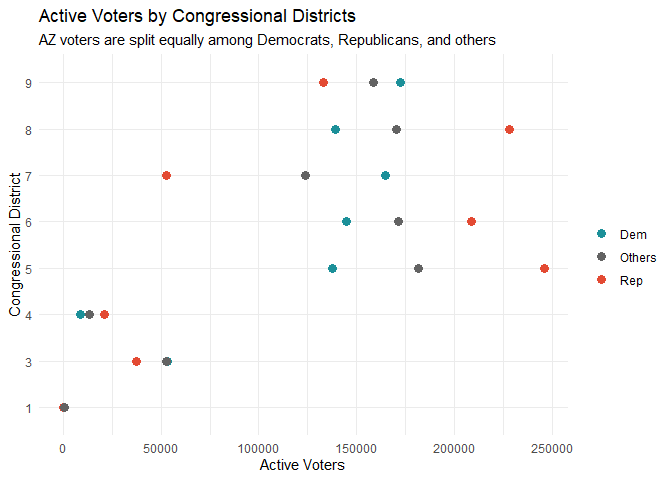

On October 6, 2020, the New York Times published an
[article](https://www.nytimes.com/2020/10/06/opinion/biden-trump-bellwether-counties-.html?searchResultPosition=1)
outlining the 10 bellwether counties for the 2020 Presidential
elections. On the list was Maricopa County, AZ, which accounts for
almost two-thirds of Arizona’s population. As it turned out, Arizona did
become a battleground state the President-Elect Biden flipped from
Republican to Democratic, and Maricopa County provided him with the
votes to do so.

Now that the dust has settled somewhat, what we want to know are:  
1. How did Maricopa Co. voted as a whole this election as compared to
2016?  
2. Did Maricopa Co.’s 8 congressional districts vote very differently
from one another?  
3. How many new voters were registered between 2016 and 2020, and in
which congressional districts can they be found?

Parts of this analysis are scaled to Maricopa County’s 8 congressional
districts to be consistent across electoral cycles, even though they are
of different sizes. This is because Maricopa County is further divided
into more than 700 electoral precincts. Ideally, we would compare
precincts over the two elections. Complicating this effort, however, is
the fact that the number of precincts have increased since 2016 and the
boundaries have changed. What has remained constant, however, are the
boundaries of congressional districts. Furthermore, the Maricopa County
Recorder’s Office and the AZ Secretary of State keep records on voter
registration by congressional districts.

### Mapping and Charting the Vote

Using the `mapboxapi` and `leaflet` packages in R, shapefiles of
congressional districts in Arizona and election results downloaded from
the Maricopa County Recorder Office’s website, I was able to produce the
following map. The map aggregates results from the Presidential
Elections in both 2016 and 2020 at the geographical scale of
congressional districts. The colors represent the percentage of votes
obtained by each candidate pair.  

Expressed as a dot and dumbbell plot:

What we can observe from this map is that for the most part, electoral
support for Trump has remained steady between 2016 and 2020 in all
congressional districts. What has appeared to happen is a strengthening
of support for the Democrats, especially in Congressional Districts 5,
and 9, at the expense of third-party candidates such as the
Libertarians. On the other hand, Republican vote share has remained
remarkable steady between 2016 and 2020.

It is pretty clear that majority-Republican congressional districts
remained solidly so, and the Democrats did not succeed in flipping any
congressional districts to their favor. The implication here is that it
is impossible to tell if these Democrat-converts in 2020 will remain
Democrats in the future.

To dive a little deeper into this question, I looked at most up-to-date
voter registration data, again available from the Maricopa County
Recorder’s Office. It appears that registered Democratic voters remain
in the minority in multiple populous congressional districts.

### tl;dr

It is simple. Democrats cannot afford to assume that Arizona will
continue to be theirs for the taking because there is a significant pool
of Republican voters whose share of the votes remain consistent. On the
other hand, Democratic electoral success is heavily dependent on peeling
off enough voters who may not identify with either of the two main
parties usually because Democrats number fewer than Republicans in most
congressional districts. In other words, as a state, AZ will remain
competitive for both parties.
